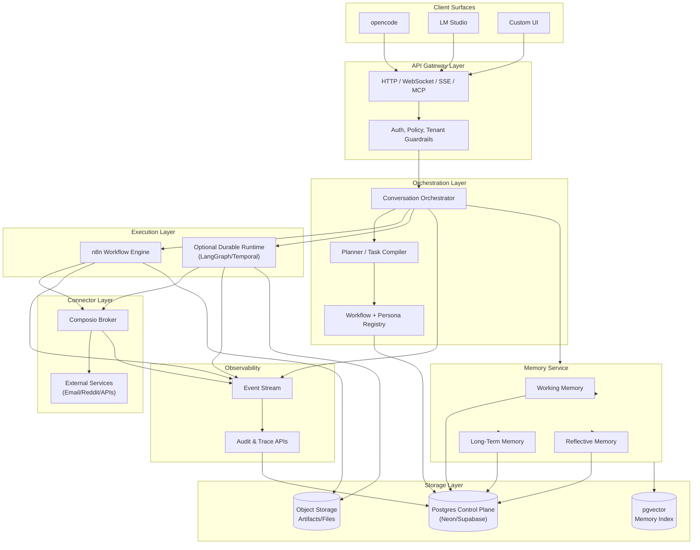

# Backend Harness Architecture

## Executive Summary

This document defines the architecture for a backend-only agentic system that works behind multiple frontends (opencode, LM Studio, custom UI). The system follows a **database-first control plane** architecture with workflow-first execution, agent-updatable database state, and governed evolution capabilities.

### Core Architectural Principles

1. **Postgres as Canonical System of Record**: All state, configuration, workflows, and audit trails stored in a single authoritative database
2. **Workflow-First Execution**: Every non-trivial request must become a task graph and then a workflow run
3. **Governed Self-Modification**: Agents can propose changes to prompts, personas, workflows, and DB state, but changes remain observable, reversible, and policy-controlled
4. **Multi-Frontend Support**: Backend serves multiple client surfaces without changing business logic
5. **Strict Tenant Isolation**: Complete isolation at tenant/workspace level with RLS and default-deny policies

## Technology Stack

### Database Layer
**Primary Choice**: Neon Postgres
- Copy-on-write branching from current or past state
- Fast restore and point-in-time recovery
- Serverless HTTP/WebSocket Postgres access
- Logical replication for event streaming
- Ideal for per-workflow sandboxes and replayable config changes

**Alternative**: Supabase
- When bundled Auth, Storage, Realtime, Edge Functions are required
- Note: Branches are separate environments, don't include production data by default

### Workflow Engine
**n8n** (Mandatory in first release)
- Primary drag-and-drop workflow engine and operator-facing editor
- Queue-mode scaling with workers and Redis
- Sub-workflows, looping, wait/resume with DB offload
- Workflow history and Git-based source control
- MCP client/server support
- Human approval gates for tool calls

**Important**: n8n is NOT the sole source of truth. Canonical workflow definitions stored in database with n8n as one execution adapter.

### Connector & Tool Broker
**Composio** (Primary)
- 1000+ toolkits with managed authentication
- In-chat and manual auth flows
- MCP/direct APIs support
- Session-scoped meta-tools
- Parallel execution support
- Sandbox/workbench support
- Dynamic tool discovery

### Future Execution Engines (Phase 2+)
- **LangGraph**: For durable subflow runtime with checkpoints and long-term memory
- **Temporal**: For ultra-durable, long-running, failure-sensitive workflows
- Add only when production pain justifies operational complexity

## System Architecture

## Core Architectural Rules

1. **Database-First Authority**
   - Postgres is canonical system of record for tenants, workspaces, conversations, prompts, personas, workflows, runs, audit, approvals, and memory metadata
   - n8n JSON is NOT the only truth - canonical workflow definitions stored in DB
   - Workflow adapters compile/sync from DB to n8n (and future runtimes)

2. **Workflow-First Execution**
   - Every non-trivial user request must first become a Task Graph
   - Task Graphs are then compiled into Workflow Runs
   - Runtime rejects ad hoc execution paths that bypass workflow creation
   - Ensures traceability, auditability, and governance

3. **Governed Mutation Model**
   - Agents update DB state, prompts, workflows, and connector config only through governed mutation APIs
   - Four mutation classes:
     - **Class A**: Ephemeral working-memory writes (auto-commit)
     - **Class B**: User/profile memory writes (auto-commit if confidence threshold met)
     - **Class C**: Workflow/prompt/persona drafts (create/update but no publish without approval)
     - **Class D**: Production publishes, connector scopes, destructive changes (require approval)

4. **Multi-Tenancy & Isolation**
   - Tenant/workspace isolation using Postgres RLS
   - Default-deny policies for all tenant-scoped tables
   - Per-tenant connector/account boundaries
   - Backend service identities for privileged operations

5. **Versioning & Rollback**
   - Immutable versions for prompts, personas, and workflows
   - Every publishable object carries version lineage
   - Automatic rollback pointers for production publishes
   - Support draft, validate, approve, publish, rollback lifecycle

## Canonical Database Schema

### Identity & Access
- `tenants`: Multi-tenant isolation root
- `workspaces`: Workspace-level grouping within tenants
- `users`: End users with authentication
- `service_accounts`: Service-to-service identities

### Configuration & Definitions
- `personas`: Agent personas with behavior definitions
- `persona_versions`: Immutable persona version history
- `prompt_templates`: Reusable prompt templates
- `prompt_versions`: Immutable prompt version history
- `workflow_defs`: Canonical workflow definitions
- `workflow_versions`: Immutable workflow version history
- `workflow_adapter_artifacts`: Runtime-specific compiled artifacts (n8n JSON, etc.)

### Execution & State
- `conversations`: User conversation threads
- `messages`: Individual messages within conversations
- `task_graphs`: Compiled task graphs from user requests
- `tasks`: Individual tasks within graphs
- `task_edges`: Dependencies between tasks
- `workflow_runs`: Workflow execution instances
- `step_runs`: Individual step executions within runs
- `run_events`: Detailed event stream for runs

### Memory & Knowledge
- `memory_items`: Multi-type memory store with kinds:
  - `semantic`: Factual knowledge across sessions
  - `episodic`: Event memories with temporal context
  - `procedural`: Learned procedures and preferences
  - `reflective`: Meta-learning from prior runs
- `artifacts`: Files, generated objects, large payloads

### Integration & Tools
- `connectors`: External service connector definitions
- `connector_accounts`: User-specific service accounts
- `connector_sessions`: Active session state
- `tool_manifests`: Tool capability declarations
- `tool_invocations`: Tool execution history

### Governance & Audit
- `mutation_proposals`: Proposed changes before commit
- `mutation_commits`: Committed changes with before/after
- `approvals`: Approval records for governed actions
- `audit_events`: Comprehensive audit trail
- `evaluation_runs`: Testing and validation runs
- `test_cases`: Test case definitions
- `goldens`: Golden outputs for regression testing

### Version Metadata (for all mutable objects)
Every mutable business object must carry:
- `id`: Stable identifier
- `slug`: Human-readable name
- `version_id`: Immutable version identifier
- `parent_version_id`: Version lineage tracking
- `created_by_actor`: Creating user/service account
- `created_from_run_id`: Originating workflow run
- `approval_state`: Draft/pending/approved/rejected
- `published_at`: Publication timestamp
- `rollback_target`: Safe rollback version pointer

## Workflow Schema

### Canonical Workflow Specification
- **Metadata**: Name, description, version, tags
- **Version Hash**: Content-based versioning
- **Input/Output Schemas**: Typed contracts
- **Node List**: Individual workflow steps
- **Edge List**: Dependencies and control flow
- **Policies**:
  - Retry policy
  - Timeout policy
  - Approval policy
  - Concurrency policy
- **Security**:
  - Tool allowlist
  - Memory read/write rules
- **Adapter Metadata**: n8n, LangGraph, Temporal specific configs
- **Validation Status**: Schema validation state
- **Publish Status**: Draft/published/archived

### Node Types
- **Planner**: Task decomposition and planning
- **Conditional Gate**: Branching logic
- **Loop**: Iteration constructs
- **Tool Call**: External tool execution
- **DB Read/Write**: Database operations
- **Sub-Workflow Invoke**: Workflow composition
- **Wait**: Temporal delays
- **Webhook Resume**: Async callback handling
- **Human Approval**: Manual approval gates
- **Summarization/Compaction**: Memory optimization
- **Artifact Transform**: Data transformation
- **Terminal Response**: Workflow completion

## Persona Schema

A persona version stores:
- **System Prompt**: Base instructions
- **Delegation Policy**: Sub-agent invocation rules
- **Tool Policy**: Allowed/forbidden tools
- **Write Policy**: Database mutation permissions
- **Memory Policy**: Memory access patterns
- **Safety Policy**: Content and behavior constraints
- **Default Workflow Templates**: Starting workflows
- **Fallback Behavior**: Error handling
- **Model Routing Hints**: Preferred model configurations
- **Evaluation Notes**: Performance characteristics
- **Changelog**: Version-to-version changes

## Memory Model

### Three Memory Scopes

#### Working Memory (Thread/Conversation Scoped)
- Current messages in active conversation
- Pending tasks and intermediate results
- Retrieved documents for current context
- Artifacts being created/modified
- Temporary variables and state
- **Lifecycle**: Cleared at conversation end or compacted periodically

#### Long-Term Memory (Namespace Scoped)
- Semantic facts across sessions
- Episodic events with temporal context
- Procedural preferences and learned rules
- User preferences and profile data
- **Lifecycle**: Persistent across sessions, selectively promoted from working memory

#### Reflective Memory (System Level)
- Compact lessons learned from prior runs
- Failure patterns and root causes
- Successful strategies and tactics
- Review outcomes and feedback
- **Lifecycle**: Accumulated over time, used to improve future executions

### Memory Management
- Do NOT store all memory as chat history
- Summarize or compact working memory over time
- Selectively promote durable memories from working to long-term
- Use vector indexing (pgvector) for semantic search
- Apply memory read/write rules from persona policies

## API Contracts

### REST/HTTP APIs

#### Conversation Management
- `POST /v1/conversations` - Create new conversation
- `POST /v1/conversations/{id}/turns` - Submit user turn
- `GET /v1/conversations/{id}/stream` - Stream conversation events

#### Task & Workflow Execution
- `POST /v1/task-graphs` - Create task graph
- `POST /v1/workflows` - Create/update workflow definition
- `POST /v1/workflow-runs` - Start workflow execution
- `GET /v1/workflow-runs/{id}` - Get run status
- `POST /v1/workflow-runs/{id}/resume` - Resume paused run

#### Governance
- `POST /v1/approvals/{id}/decision` - Approve/reject action
- `POST /v1/mutations/propose` - Propose state change
- `POST /v1/mutations/{id}/approve` - Approve mutation

#### Configuration
- `POST /v1/personas` - Create persona
- `POST /v1/persona-versions/{id}/publish` - Publish persona version
- `POST /v1/connectors/{id}/authorize` - Authorize connector

#### Tools & Memory
- `POST /v1/tools/execute` - Execute tool
- `POST /v1/memory/search` - Search memory

#### Observability
- `GET /v1/traces/{id}` - Get execution trace
- `GET /v1/audit` - Query audit log

### Streaming Events (SSE/WebSocket)

#### Conversation Events
- `conversation.started`
- `task_graph.created`

#### Workflow Events
- `workflow_run.started`
- `workflow_run.completed`
- `workflow_run.failed`

#### Step Events
- `step.started`
- `step.waiting`
- `step.completed`

#### Approval Events
- `approval.requested`
- `approval.resolved`

#### Tool Events
- `tool.called`
- `tool.completed`

#### Mutation Events
- `db.mutation.proposed`
- `db.mutation.committed`

## Connector Interface

### Plugin Contract
Every connector must declare:
- **Connector ID & Version**: Unique identifier
- **Auth Mode**: OAuth / API key / JWT / Service account / Webhook secret
- **Scopes/Capabilities**: Permissions required
- **Actions**: Available operations
- **Triggers/Webhooks**: Event subscriptions
- **Input/Output Schemas**: Typed interfaces
- **Idempotency Support**: Retry safety
- **Dry-Run Support**: Validation without execution
- **Rate Limit Metadata**: Throttling information
- **PII Redaction Policy**: Privacy controls
- **Audit Metadata**: Logging requirements
- **Required Approval Level**: Governance tier
- **Retryability Classification**: Error handling
- **Cancellation Support**: Abort capability

### Mandatory Methods
- `discover()` - List available capabilities
- `authorize()` - Perform OAuth/auth flow
- `validate()` - Validate credentials/config
- `dry_run()` - Test without side effects
- `execute()` - Perform action
- `cancel()` - Abort in-progress action
- `verify_webhook()` - Validate webhook signatures
- `redact()` - Apply PII/secret redaction

## Plugin & Extension Model

### Plugin Types
- **Workflow Adapters**: Runtime-specific compilation
- **Connector Adapters**: External service integration
- **Memory Backends**: Alternative memory stores
- **Observability Sinks**: Trace/metric destinations
- **Policy Packs**: Governance rule sets
- **Evaluators**: Testing and validation
- **Artifact Processors**: File/data transformations

### Plugin Requirements
Every plugin must declare:
- **Capability Matrix**: Feature support grid
- **Security Boundary**: Trust and isolation model
- **Version Compatibility**: Supported harness versions
- **Migration Hooks**: Upgrade procedures
- **Health Checks**: Liveness and readiness probes

## Runtime Orchestration

### Execution Modes

#### Ephemeral Mode
- Short request/response turns
- Synchronous execution
- Low-latency path
- In-memory state
- Use for: Quick queries, simple tasks

#### Durable Mode
- Long-running jobs
- Asynchronous execution
- Persistent state
- Resumable after failures
- Use for: Workflows with waits, approvals, callbacks, external triggers

### Phase-One Orchestration Policy
1. Compile user request to task graph
2. Map task graph to canonical workflow definition
3. Execute in n8n by default
4. Persist run and step state in Postgres
5. Use durable resume semantics for waits/approvals/webhooks

### Phase-Two Policy Extensions
- Allow selected nodes/subgraphs to run via LangGraph when marked `durable_class = medium`
- Allow selected workflows to run via Temporal when marked `durable_class = high`
- Keep n8n as default for most workflows

## Security Model

### Core Security Principle
**"Agents may propose broadly, but may commit narrowly."**

### Security Requirements

#### Tenant Isolation
- Enforce with Postgres RLS and default-deny policies
- Use backend service identities for privileged operations
- Never allow workflow engines to connect as superuser

#### Secret Management
- Store connector secrets outside workflow JSON
- Use managed auth or external secret manager
- Expose only secret references to workflows and agents

#### Approval Gates
- Require human approval for:
  - Destructive tools
  - External sends (email, posts, etc.)
  - Production publishes
  - Connector scope changes
- Use tool-level approval, not only output-level

#### Execution Isolation
- Run n8n code execution in external task-runner mode
- Harden runners as isolated sidecars/containers
- Avoid internal mode in production

#### Data Redaction
- Enable execution data redaction for PII, secrets, financial data
- Do NOT put sensitive data in searchable workflow metadata
- Apply redaction at storage and display layers

#### Access Control
- Expose workflows to MCP clients through explicit allowlisting
- Use revocable credentials and token rotation
- Maintain audit trail of all access

#### Rollback & Recovery
- Keep branch/restore rollback path for all configuration
- Use Neon branching for "bad agent update" recovery
- Pre-publish validation in isolated branches

#### Patch Discipline
- Fast upgrades for critical security advisories
- Access control on workflow editing
- Isolated execution environments mandatory

#### Webhook Security
- Explicit allowlists for callback endpoints
- Webhook signature verification
- IP/device restrictions
- Idempotency keys for all state changes

## Observability & Debugging

### Operator Views Required

#### Conversation Timeline
- User turns, task graphs, sub-workflows
- Tool calls, approvals, final outputs
- Append-only event stream keyed by conversation/run/step ID

#### Workflow Graph View
- Active node, branch decisions, retries
- Waits, loop counts, failed nodes
- Resume points and state transitions
- Node-level metadata

#### State Diff View
- Prompt/persona/workflow version changes
- DB mutations with before/after JSON
- Publish lineage and rollback targets

#### Approval Inbox
- Pending dangerous tool calls
- Production publishes awaiting review
- SLA tracking, reviewer identity
- Original vs. edited parameters

#### Replay/Debug
- Re-run from prior input
- Resume from checkpoint
- Restart from failed node
- Fixture capture for testing

#### Search & Filtering
- By tenant, user, workflow, persona
- By status, connector, tool
- By cost, latency, error type
- Indexed search attributes

#### Compliance Export
- Who changed what, when, why
- From which run, with which approval
- Immutable audit events
- Configurable retention policies

### Backend Requirements
- Graph topology retrieval APIs
- Event streaming (SSE/WebSocket)
- Node-level log retrieval
- State snapshot APIs
- Version comparison
- Approval action APIs
- Filtered run search
- Replay request APIs
- Machine-readable audit export

## Testing Strategy

### Unit Testing
- Planner and workflow compiler logic
- Memory promotion and compaction rules
- Policy enforcement logic
- Mutation validation

### Contract Testing
- Every connector interface
- Tool input/output schemas
- API endpoint contracts
- Webhook payloads

### Snapshot Testing
- Workflow specifications
- Persona versions
- Canonical schemas

### Replay Testing
- Recorded runs against new workflow versions
- Before publish validation
- Regression detection

### Integration Testing
- Golden task graphs with expected outputs
- Expected run traces
- End-to-end workflows
- Error handling paths

### Migration Testing
- Against branched databases
- Schema evolution
- Data migration correctness

### Canary Testing
- Workflow version rollout
- Persona version rollout
- Before tenant-wide deployment

## Migration Strategy

### Phase One: Monolithic Harness
- Single harness API service
- Postgres database (Neon/Supabase)
- n8n workflow engine
- Composio connector broker
- Basic observability
- Core governance

### Phase Two: Selective Decomposition
- Split connector broker if throughput/security requires
- Add durable code runner for selected subflows (LangGraph)
- Enhanced observability and debugging
- Advanced governance features

### Phase Three: Scale & Durability
- Add Temporal for ultra-durable workflows (if needed)
- Multi-region considerations
- Advanced replay and time-travel
- Sophisticated memory strategies

### Migration Invariants
- Never break canonical workflow schema without versioned migration
- Keep adapter artifacts disposable and regenerable
- Maintain backward compatibility for published workflows
- Document all breaking changes

## Cost & Operations Constraints

### Phase One Constraints
- Do NOT run both LangGraph and Temporal on day one
- Keep Redis optional until queue pressure proves necessity
- Put large artifacts in object storage, not execution tables
- Use DB branching/PITR for rollback and test environments

### Resource Management
- Monitor workflow execution costs
- Track token usage per tenant/workflow
- Set cost limits and alerts
- Optimize expensive operations

### Operational Requirements
- Automated backups and restore testing
- Monitoring and alerting
- Incident response procedures
- Patch management process
- Capacity planning
- Performance tuning

## Acceptance Criteria

The harness is acceptable only if:

1. **Traceability**: Any request can be decomposed into a task graph and traced end-to-end
2. **Observability**: Operator can see which workflow version, persona version, tools, approvals, and DB mutations were involved
3. **Resumability**: Failed or paused runs can be resumed or replayed
4. **Rollback**: Changed prompts or workflows can be rolled back
5. **Multi-Frontend**: Same backend serves at least two different client surfaces without changing business logic
6. **Governed Evolution**: Agents can improve system through draft mutations without bypassing governance
7. **Security**: Tenant isolation, secret management, and approval gates work correctly
8. **Durability**: Long-running workflows survive crashes and redeploys
9. **Auditability**: Complete audit trail of all state changes and decisions
10. **Testability**: Can replay recorded runs and validate against golden outputs

## References

This architecture synthesizes patterns from:
- Postgres-based control planes (Neon, Supabase)
- Visual workflow engines (n8n, Windmill)
- Durable execution frameworks (LangGraph, Temporal)
- Managed connector platforms (Composio, Pipedream)
- Agent memory architectures (hierarchical, episodic, reflective)
- Research on governed self-modification and multi-agent systems
